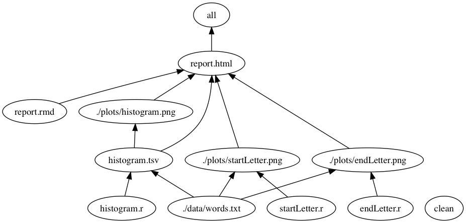
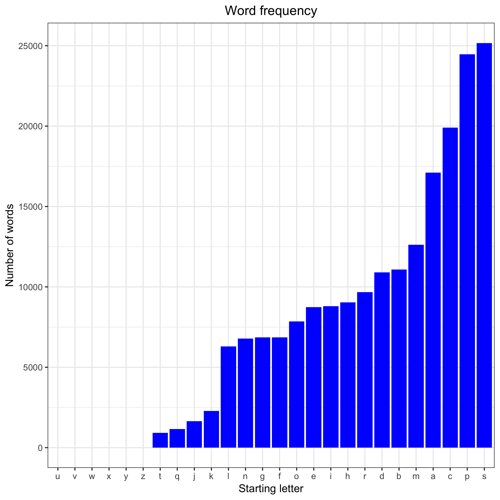
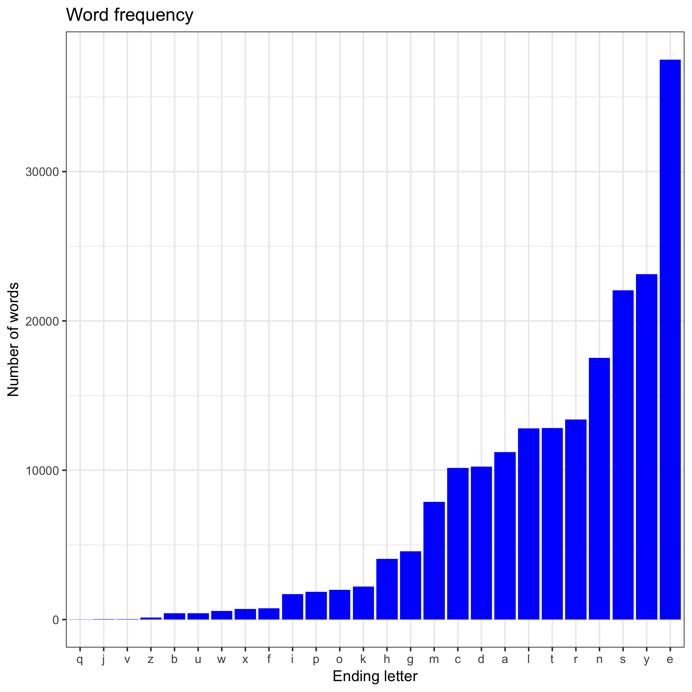

Homework 09: Automating Data-analysis Pipelines
=============
This assignment is built on [this repository.](https://github.com/STAT545-UBC/make-activity)

For this assignment, I added two R functions to count the number of words which start or end with English letters. And each function will generate one plot for that function. The plots are added into both the existing pipeline and the R and Rmd files. I still kept the orginal pipeline. You can run `make all clean` in the home folder on the terminal or comman prompt. 

Document | Content
--------- | --------
[startLetter.R](https://github.com/STAT545-UBC-students/hw09-Mengsuper/blob/master/startLetter.R) | R file for counting start letters
[endLetter.R](https://github.com/STAT545-UBC-students/hw09-Mengsuper/blob/master/endLetter.R) | R file for counting start letters
[report.md](https://github.com/STAT545-UBC-students/hw09-Mengsuper/blob/master/report.md) | report document
[report.Rmd](https://github.com/STAT545-UBC-students/hw09-Mengsuper/blob/master/report.rmd) | report source file. 

I added some folders (data, plots) to the project for better structure. In order to better visualize the workflow, I used the [makefile2dot](https://github.com/vak/makefile2dot) to create a graph of the pipeline. 

The plot for number of words starting with English letters. 

The plot for nubmer of words ending with English letters. 

make-activity
=============

The commit history of this repository reflects what a student might do as she works through [this activity](http://stat545-ubc.github.io/automation04_make-activity.html) from [STAT 545](http://stat545-ubc.github.io). This fully developed example shows:

  * How to run an R script non-interactively
  * How to use `make`
    - to record which files are inputs vs. intermediates vs. outputs
    - to capture how scripts and commands convert inputs to outputs
    - to re-run parts of an analysis that are out-of-date
  * The intersection of R and `make`, i.e. how to
    - run snippets of R code
    - run an entire R script
    - render an R Markdown document (or R script)
  * The interface between RStudio and `make`
  * How to use `make` from the shell
  * How Git facilitates the process of building a pipeline
